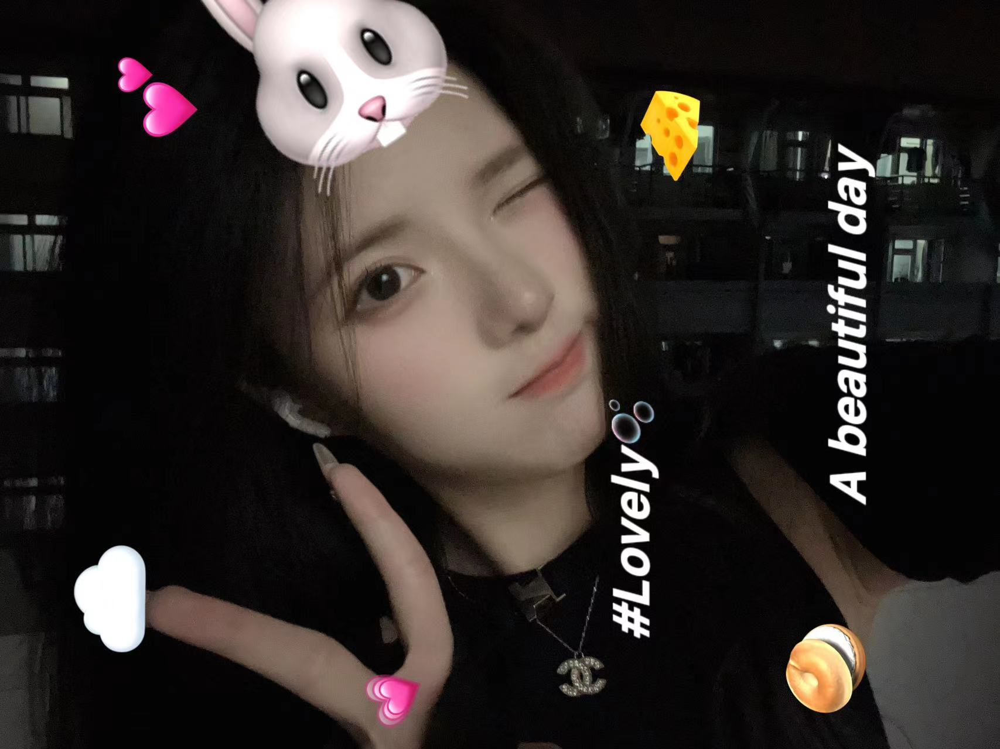

# 厉亮的个人知识库

## 2023.5.21建立 
- 起因是在刚刚接触到**分子动力学**和**机器学习**的交叉领域时，文献中发现了很多抽象代数和更为复杂的数学概念（群、域、环…），同时和结构化学连接紧密，要真正理解这些概念需要把这些知识融会贯通。现有的知识框架和整理习惯不足以高效率完成学习任务，故建立此知识库。

[**开启阅读**](/README.md)
[**每日进展**](everday/)

