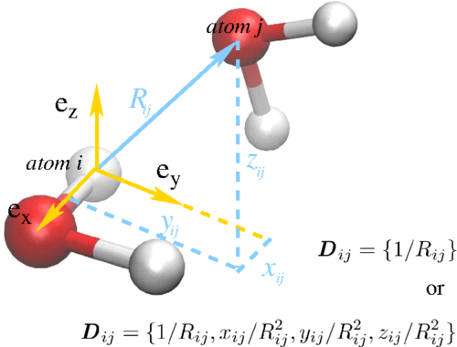
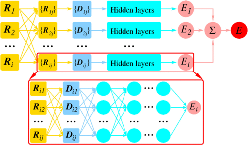

# Deep Potential Molecular Dynamics: A Scalable Model with the Accuracy of Quantum Mechanics

> &#160; &#160; &#160; &#160;本文是鄂维南院士被引次数第三高的文章，发表于2018年，本文的重点在于如何把分子动力学中分子系统的所有自然对称性加入到模型中。本片文章是奥卡姆剃刀原理的很好例子，对比大量出现的复杂的神经网络模型，该文章仅采用最简单的全连接神经网络，把重心放在数据的处理上，让数据能够直接带有平移、旋转、反射不变性。
> 
> 摘要：
> 
>&#160; &#160; &#160; &#160;我们介绍了一种分子模拟方案，即深度势分子动力学（DPMD）方法，该方法基于用**从头算数据**训练的深度神经网络产生的多体势和原子间力。神经网络模型保留了问题中的所有自然对称性。它是基于这样一种意义上的第一原则，即除了网络模型之外没有特设组件。我们表明，所提出的方案在包括大块材料和分子在内的各种系统中提供了高效和准确的协议。在所有这些情况下，DPMD给出的结果与原始数据基本上无法区分，**其成本与系统大小成线性比例**。

## 第一部分：介绍背景
&#160; &#160; &#160; &#160;文章指出AIMD是可以让分子动力学计算达到DFT的计算精度，但是其高昂的成本限制了这种计算方法只能在百来原子、~100ps的尺度上。目前只有经验力场(FF)方法才能做到更大单元更长时间的模拟，但这些模型的准确性和可传递性是被质疑的。作者从这里表达出了他的思想：**用AI学习AIMD的数据并能达到DFT的精读，再用到大场景里**。

&#160; &#160; &#160; &#160;发展FF却是困难的，因为势能的多体性。两三体的相互作用也许能够捕捉，但也限制在弱相互作用力下才是有效的。大量的势能方法都包含的一个思路是：键的强度取决于局部环境，但是这种依赖关系只能粗略近似。这个时候就要借助机器学习这个工具，但是，如果要训练分子动力学轨迹（trajectories）预测的话，**是不可以直接用里面的原子坐标的，因为这没有保留系统的平移、旋转、排列的对称性（不变性）**，不同的模型用不同的思想做到这一点。

## 第二部分：方法
&#160; &#160; &#160; &#160;文章提出了一个基于神经网络的分子动力学模拟方法，称为深度势分子动力学，并解释这种方法能克服上述对称矩阵和库伦矩阵的限制。具体是怎么做的，下面进行详细的描述：
**首先需要再次强调的是，文章所做的处理全是围绕着如何保持分子系统的各类对称性：平移、旋转、排列。**
> **这些对称性是什么意思？而保持这种对称性又是什么意思？**
> 
> &#160; &#160; &#160; &#160;首先：分子系统因为过于微观，我们只关注分子、原子之间的相互作用力。所以，在系统整体平移、旋转、或改变原子标号顺序的时候，一切的情况都是不变的，这是非常容易理解的。但是来到程序编程中情况就不一样，如果仅仅采用每个原子的绝对坐标，那么势必当系统平移、旋转、改变标号的时候，输入神经网络的输入会完全不一样，如果要神经网络自身去理解这些对称性，那几乎是不可能的（或需要极其大量的数据和更大的网络）；相比之下，**用一种简单的方法让输入自然的在这些对称性操作下不会发生改变**，就解决了这个问题。
 
文章是怎么做到的呢？首先文章的描述是：
>在DeepMD中，每个原子都有一个局部环境和局部参考系，每个局部环境都包含了有限数量的原子，并且局部坐标按照一种方法保持排列。

&#160; &#160; &#160; &#160;首先看文章对单一原子的处理，首先设定一个截断半径$R_c$,并以这个原子为中心建立一个坐标系。以图为例，这是一个水分子，以原子i作为中心原子，**坐标系$(e_x,e_y,e_z)$的建立：$e_x$沿着O-H键，$e_z$垂直水分子的平面，$e_y$是他俩的叉乘**。根据这个坐标系就能得到$R_{ij}$的向量:$(x_{ij},y_{ij},z_{ij})$。随后规定在数据中的排序关系，首先按照原子种类排序，氧原子先、氢原子后，然后再从距离由近到远排列。
>经过这个处理后，每一个原子得到了独特的坐标系，**由这种坐标系建立的坐标数据在平移、旋转、重排的情况都不变**。

要作为神经网络的输入还需要进一步处理，因为距离越远其权重应当越低，所以实际输入不是$R_{ij}$,而是有两种：
$$D_{ij}=\{1/R_{ij},x_{ij}/R_{ij}^2,y_{ij}/R_{ij}^2,z_{ij}/R_{ij}^2\}$$
或者$$D_{ij}=\{1/R_{ij}\}$$

## 网络结构

输入是经过处理后得到的D，输出是每一个原子的能量$E_i$,然后进行加和得到系统的总能量。文章提到用了一个灵活的损失函数族：
$$
L(p_\epsilon,p_f,p_\xi)=p_\epsilon\Delta\epsilon^2+\frac{p_f}{3N}\sum_{i}\begin{vmatrix}\Delta F_i\end{vmatrix}^2+\frac{p_\xi}{9}\begin{Vmatrix}\Delta\xi\end{Vmatrix}^2
$$

&#160; &#160; &#160; &#160;其中，$\epsilon$是损失的能量/原子数，$F_i$是原子i的受力。$\xi$是一个virial tensor（目前还不清楚它的物理意义）
$$
\Xi=-\frac{1}{2}\sum_{i}R_i\bigotimes F_i
$$
再除以原子总数N。

## 实验部分
为了测试这个模型的性能，要用到AIMD的数据集，