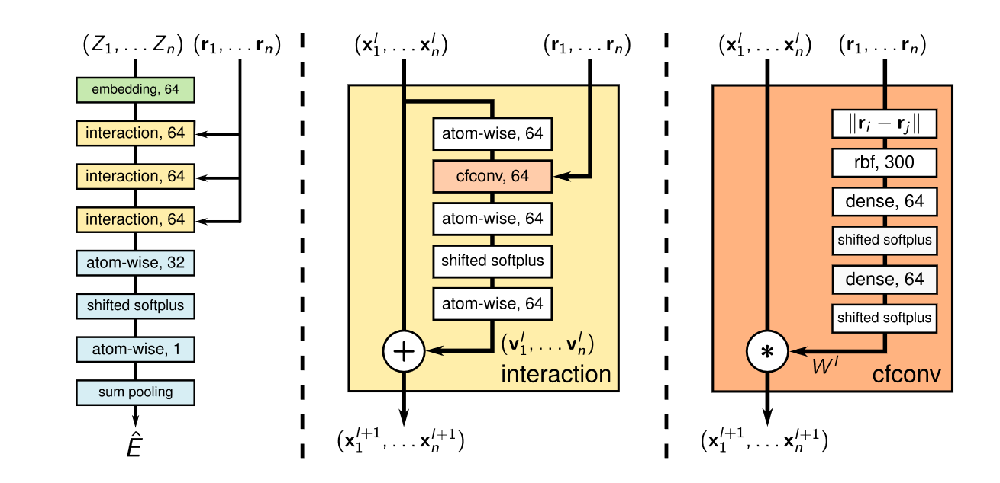

&#160; &#160; &#160; &#160;
# SchNet: A continuous-filter convolutional neural network for modeling quantum interactions
## 摘要
> &#160; &#160; &#160; &#160;深度学习有望带来量子化学的**革命**，因为它能够合适且理想地学习结构的表示和加速化学空间的探索。现在卷积神经网络很火，它要求网格，但是原子的精确位置信息包含了重要的物理信息，把位置离散化会丢失很多信息。因此，本文提出嘞一种连续-滤波器的卷积层，能够对位置相互关系进行建模同时不需要把数据变成网格。本文提出了SchNet：新型的分子内量子效应的深度学习模型。我们获得了一个**遵循量子化学原理**的分子间总能量和原子间作用力的联合模型。本文结构达到SOTA表现在平衡分子和分子动力学轨迹预测上。最后提出了一个更有挑战性的benchmark。
## 引言
> 首先需要了解到的是，这是在2017年NIPS顶会上发表的，时间较早，在读完这片文献后，再精读后续的几篇文献，**可以明显看出模型的升级思路**，这是十分重要的。

&#160; &#160; &#160; &#160;在引言部分，作者除了常见的介绍方法，提出：QM9类似的dataset包含的都已经是平衡位置的分子信息，然而通过模拟得到原子的平衡位置本身就是一个重要问题，提出了先前方法所忽略的地方。总的来说，对于一个新的组成(化学分子或体系），平衡位置是不能直接获得的，需要通过不断优化原子的位置，计算势能面，通过长时间计算模拟获得稳态。因此对于分子动力学模拟，必须计算每一个原子的能量 $E(r_1,...,r_n)$，以及作用在原子上的力。
**&#160; &#160; &#160; &#160;下面的式子是分子动力学的核心公式，对于经验力场（FF）方法来说，越加精确的势能面，可以得到更精确的能量梯度->更精确的原子受力。**
$$
F_i(r_1,\dots,r_n)=-\frac{\partial{E}}{\partial{r}_i}(r_1,\dots,r_n).
$$
文章自己总结了它的**三个创新点**：
> 1. **提出了连续-滤波器卷积层结构，能够不再需要网格化数据**
  2. **提出了SchNet结构：一种能够遵循量子化学约束的神经网络**
3. **提出了一种包含构象转变的更有挑战的benchmark：ISO17**
## 方法
### 连续卷积层
> **&#160; &#160; &#160; &#160;可以明显看出，这篇文章将这个卷积层作为了最重要的创新点，让我们来看看它是怎么做的。**

&#160; &#160; &#160; &#160;首先，作者觉得卷积是一个不错的方式，但是分子结构和图像不一样，它是不均匀的间隔数据。既然想要构造一个卷积层，那么它应该还具有卷积的重要特性：**权重共享、平移不变**。设定如下：

对于一个具有n个原子的体系:$X^l = (x_1^l,/dots,x_n^l)$，其中$x_i^l\in\R^F$代表了每个原子的表示（具有F个特征），原子的坐标储存在$R=(r_1,\dots,r_2)$其中$r_i\in\R^D$。那么这个连续的卷积层首先要作为一个滤波-生成函数：
$$
W^l:\R^D\to\R^F
$$
文中解释这个滤波器是由神经网络建立成的，来看直接的表达式：
$$
x_i^{l+1}=(X^l*W^l)_i=\sum_{j}x_j^l\circ W^l(r_i-r_j)
$$
**&#160; &#160; &#160; &#160;其中$\circ$意思为相应位置相乘（类似图像卷积核），由上文可以得到这个$W^l\in\R^{F\times D}$，F行D列的权重矩阵，先右乘原子的相对坐标，剩下一个F个元素的向量，这个向量是本位原子i和原子j相对坐标的特征，然后与原子j本身的特征向量相乘，得到所有其他原子j的向量后全部相加，得到l+1层的原子i特征。对比一下不难发现它很像图的消息传递方法：由学习到的矩阵处理相邻节点，然后全部相加作为自身节点的特征，区别在于：每一步的消息传递的卷积核是不同的，且卷积层得到的结果是作为残差，并在最后加上原子本身的特征。**

&#160; &#160; &#160; &#160;至此，这个抽象的卷积层已经描述完了，让我们详细看看整个SchNet结构以及卷积层实际是怎么实现的吧。

> &#160; &#160; &#160; &#160;整个网络的输入是n个原子的核电荷数$(Z_1,\dots,Z_n)$和每一个原子的坐标$(r_1,\dots,r_n)$,核电荷数其实和原子序数差不多，同种原子相同，也因此：经过第一层embedding后的64维特征，同种原子得到的特征是相同的。**网络的输出是总能量E，并且这个能量可以通过反向梯度传播直接得到相对于坐标的力，对应着之前的核心公式。**

**接下来解释几个容易让人困惑的地方**:
- **atom-wise层**,对每一个原子的表示（64维度向量）乘上权重W加上b，其实就是对单个原子自身的全连接层，让原子的表示之间互相交互（可以把整个数据看做两个维度，第一个维度是全体系（全原子）作为样本，第二个维度是每一个原子作为样本，那么atom-wise就是对第二维度的样本全连接；
- **shifted softplus层**，就是一个激活函数，函数式是$ssp(x)=ln(0,5e^x+0.5)$，这个函数二次可微，因为不仅需要求力，还要根据力构造损失函数进行梯度下降，这又是一次求导。

**接下来是卷积层cfconv的解析：**

> &#160; &#160; &#160; &#160;在之前的介绍中，我们都会认为这个相对坐标的应该会保留相关的信息，但事实上没有，只用到了距离$d_{ij}=\begin{Vmatrix}r_i-r_j\end{Vmatrix}$,得到了一个距离的标量而非向量。同时作者提到：仅仅使用距离作为网络输入，数据之间过于接近，过滤器将高度相关（具体的原因作者并没有详细展开），但是这是可以理解的，仅仅是距离的标量交给神经网络，神经网络也犯难。所以提出拿径向基函数（RBF）来升维:
 $$
 e_k(r_i-r_j) =exp(-\gamma\begin{Vmatrix}d_{ij}-\mu_k\end{Vmatrix}^2)
 $$
> $\mu_k$有300个，其实就是range（0,0.1,30)单位是挨。这样一来，每个ij的相对距离都变成了大不相同的300维特征，之后再经过两个全连接层，最后进行逐元素相乘得到结果。（笔者认为这是在本文中能学到的地方了，面对数据类型相同、线性的数据，可以通过升维来增加数据的差异性，让神经网络更能够更好地区分。）
